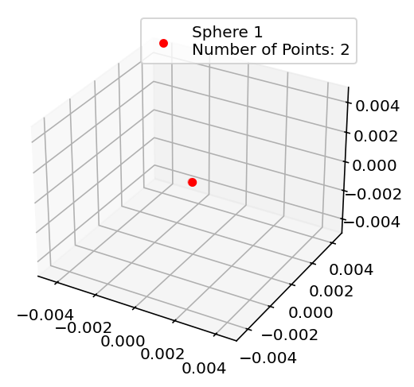

# Simulation 

Simulation part explores Python simulation of the magnet. We will start by exploring individual functions, then we would combine them.

## Python code

### Defining Sensor points 
Magpylib measures magnetic field using `Sensor` object. To get measurements from various points, we need to setup those `Sensor` points optimally across a sphere. 
Mathematical algorithm used to achieve optimal placement of points along sphere is Fibonacci lattice.
As we are not only interested in single, outermost sphere, we will need to create multiple concentric spheres embedded into the initial one to "host" the measurement points inside. 

The following code takes the following inputs:
* **`num_pts`** $\rightarrow$ Baseline number of points used to calculate the density of the outermost shell.
* **`r`** $\rightarrow$ Outer radius of the sphere (Maximum radius).
* **`num_r_points`** $\rightarrow$ The number of concentric shells to be generated.
* **`base_coord`** $\rightarrow$ An $[x, y, z]$ array representing the center point (offset) of the sphere.

And returns
* **`Sensor`**  $\rightarrow$ The final object containing the calculated coordinate points.

```python
import numpy as np
import magpylib as magpy

r_roi=5                     #region of interest
num_pts=100                # baseline number of points on outermost shell
r=r_roi/1000
num_r_points=10             #number of concentric shells
base_coord=[0,0,0]


r_points = np.linspace(0.1/1000,r,num_r_points)    # array where every element is radius of corresponding concentric sphere


for rr in r_points:

    num_pts_each_rad = np.ceil(num_pts*rr / r) #normalizing number of points for each radius based on the ratio of the radius
    indices = np.arange(0, num_pts_each_rad, dtype=float) + 0.5
    
    phi = np.arccos(1 - 2*indices/num_pts_each_rad)
    theta = np.pi * (1 + 5**0.5) * indices
    x, y, z = rr*np.cos(theta) * np.sin(phi), rr*np.sin(theta) * np.sin(phi), rr*np.cos(phi);
    
    arr = np.stack((x,y,z),axis=1)
    
    
    if(rr==0.1/1000):
        arr_full = arr
    else:
        arr_full = np.vstack([arr_full, arr])
    
arr_full[:,0] = arr_full[:,0]+base_coord[0]
arr_full[:,1] = arr_full[:,1]+base_coord[1]
arr_full[:,2] = arr_full[:,2]+base_coord[2]

sensor = magpy.Sensor(position=arr_full,style_size=2)
```

The following illustration helps to visualize the process. 



## Simulation results

# Design and Build

design part

## 3d printing

3d printing part

## winding

winding part

# Testing and validation

testing and validation part


```{code-cell} 
import matplotlib.pyplot as plt
import numpy as np
from numpy.linalg import norm
import magpylib as magpy
import pickle
import pyvista as pv
import pandas as pd

print("Success! The Python code is executing.")
```

